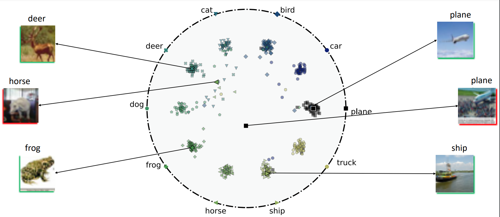

# Hyperbolic Busemann Learning with Ideal Prototypes

This is the implementation of paper [Hyperbolic Busemann Learning with Ideal Prototypes (NeurIPS2021)](https://arxiv.org/pdf/2106.14472.pdf).

The code and explanation will be updated soon.