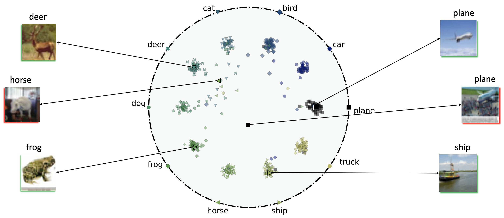

# Hyperbolic Busemann Learning with Ideal Prototypes

This is the implementation of paper [Hyperbolic Busemann Learning with Ideal Prototypes (NeurIPS2021)](https://arxiv.org/pdf/2106.14472.pdf).



## How to use?

### Prototype Learning
As the first step, you should learn prototypes for the classes in the ultimate task.
To run the code and learn the prototypes, `number of classes` and `output dimension` should be specified.

To learn prototypes with 50 output dimensionality and 100 classes, use the code,

```shell
python prototype_learning.py -d 50 -c 100
```

The output will be `prototypes-50d-100c.npy` saved in `prototypes` directory.

The code and explanation will be updated soon.

### Citation
Please consider citing this work using this BibTex entry,

```bibtex
@inproceedings{atigh2021hyperbolic,
  title={Hyperbolic Busemann Learning with Ideal Prototypes},
  author={Atigh, Mina Ghadimi and Keller-Ressel, Martin and Mettes, Pascal},
  booktitle={Thirty-Fifth Conference on Neural Information Processing Systems},
  year={2021}
}
```
